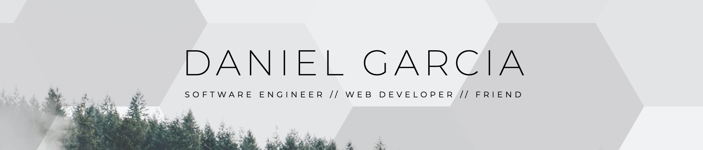

# You found me! 
**My name is Daniel Garcia.** I’m a **full stack software engineer** based in **Los Angeles, CA**.

- 👨‍💻 I'm building responsive and dynamic websites and web apps for creative professionals and SMB in my community at @**[Shy Wolf](https://shywolf.co)** and @**[Hack for LA](https://www.hackforla.org/)**
- 🏢 Previously a Senior Mechanical Engineer @**[Buro Happold](https://www.burohappold.com/)** and Project Manager @**[NYTimes](https://www.nytimes.com/)**
- ☕️ I'm always open to coffee chats! Give me a shout!
- ⚡ I'm excited to start digging into [Three.js](https://threejs.org/), [WebGL](https://get.webgl.org/), and [Spline](https://spline.design/)

 
 

<!-- 
&nbsp;

 -->

<!--
**danvgar/danvgar** is a ✨ _special_ ✨ repository because its `README.md` (this file) appears on your GitHub profile.

Here are some ideas to get you started:

- 🔭 I’m currently working on ...
- 🌱 I’m currently learning ...
- 👯 I’m looking to collaborate on ...
- 🤔 I’m looking for help with ...
- 💬 Ask me about ...
- 📫 How to reach me: ...
- 😄 Pronouns: ...
- ⚡ Fun fact: ...
-->

